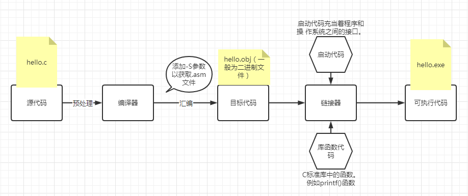

    <h1 style="font-family: 黑体; color: red;">汇编语言</h1>

---

# 引言
##### 课程工具：

1.汇编器：masm6.15
2.调试器：ollydbg
3.Dev-C++
(https://sourceforge.net/projects/orwelldevcpp/);

##### 为什么要学习汇编语言？

Ø 写出运行速度更快的代码

Ø 写出更安全的代码

Ø 有助于深入理解计算机系统

Ø 具备以二进制代码为师的能力

Ø 舒缓学习高级语言不适感
##### 要素
操作码 目的操作数，源操作数 
操作码：体现指令的语义，即指令所要完成的操作；
操作数：指令操作的对象。包括常数、内存地址、
或寄存器。
##### 反汇编指令：
-a, --archive-headers	显示归档文件（archive）头信息
-f, --file-headers	显示整个文件的头部信息
-p, --private-headers	显示特定对象格式的文件头内容
-P, --private=OPT,OPT...	显示特定对象格式的详细内容
-h, --[section-]headers	显示段（section）头部信息
-x, --all-headers	显示所有头部信息
-d, --disassemble	反汇编可执行部分的汇编代码
-D, --disassemble-all	反汇编所有部分的汇编代码
-S, --source	将源代码与反汇编代码混合显示
-s, --full-contents	显示请求段的完整内容
-g, --debugging	显示目标文件中的调试信息
-e, --debugging-tags	以 ctags 风格显示调试信息
-G, --stabs	以原始形式显示 STABS 调试信息
-W[lLiaprmfFsoRt] 或 --dwarf[=选项]	显示 ELF 可执行文件中的 DWARF 调试信息
-t, --syms	显示符号表内容
-T, --dynamic-syms	显示动态符号表内容
-r, --reloc	显示文件中的重定位项
-R, --dynamic-reloc	显示动态重定位项
@<file>	从 <file> 读取选项
-v, --version	显示当前工具的版本号
-i, --info	列出支持的对象文件格式和架构
-H, --help	显示帮助信息
##### 指定反汇编格式
 objdump -S -d -M intel main.o

 下列 i386/x86-64 特定的反汇编器选项在使用 **-M** 开关时可用（使用逗号分隔多个选项）：
  x86-64      Disassemble in 64bit mode
  i386        Disassemble in 32bit mode
  i8086       在 16 位模式下反汇编
  att         用 AT&T 语法显示指令
  intel       用 Intel 语法显示指令

  
  
##### 使用gcc自带的objdump反汇编过程
- 'gcc -c -g -o hello.o hello.c':
  -c: 只编译，不链接，生成目标文件（.o）
  -g: 生成调试信息
  -o: 指定输出文件
- 'objdump -s -d hello.o > hello.s':
  -s: 显示目标文件中的所有段
  -d: 反汇编目标文件中的代码

# 第一章汇编语言基础
- 因为实在是太多太杂只回答课后习题
- 1.1简答题
  - (1) Intel 8086 处理器 的指令系统成为 80x86 系列处理器的基本指令集

  - (2) ROM-BIOS（read only memory-basic I/O system）是存储在计算机主板上的只读存储器（ROM）中的固件程序，主要用于硬件初始化和操作系统的引导启动。
    - 1）上电自检（POST）：开机检测显卡内存键盘 
    - 2）初始化硬件设备：硬盘、键盘、显示器、USB 控制器  
    - 3）提供中断服务例程（BIOS 中断）加载操作系统：  INT 13h 访问磁盘，INT 10h 控制屏幕显示，INT 16h 读取键盘  
    - 4）引导操作系统（Boot Loader）在 BIOS 初始化完成后，会从引导设备（硬盘、U盘等）加载操作系统的启动程序
  - UEFI（Unified Extensible Firmware Interface） 是一种现代计算机系统使用的固件接口，它是传统 BIOS 的升级替代品
    - 固件介于硬件和软件之间的一种程序，运行在硬件设备上的低级软件。它通常烧录在设备的 ROM、Flash、EEPROM 等存储芯片中，负责控制硬件的基本功能
    - 固件接口 指的是 操作系统或其他程序与固件之间交互的标准或协议
  

  | 特性         | UEFI                      | BIOS             |
  |--------------|---------------------------|------------------|
  | 启动模式     | 支持 GPT 和 MBR           | 仅支持 MBR       |
  | 最大硬盘支持 | 超过 2 TB                 | 最大 2 TB        |
  | 图形界面     | 支持图形和鼠标            | 仅文本界面       |
  | 启动速度     | 更快                      | 较慢             |
  | 安全性       | 支持 Secure Boot          | 不支持           |
  | 编程接口     | 可扩展（C语言编写）       | 固定（汇编语言） |
  | 兼容性      | 更高                      | 较低             |

  - (3) 通用寄存器

| 寄存器名 | 全称           | 常见用途                          |
|----------|----------------|-----------------------------------|
| EAX      | 累加寄存器     | 常用于算术运算的结果             |
| EBX      | 基址寄存器     | 可用于间接寻址                   |
| ECX      | 计数寄存器     | 循环计数器                       |
| EDX      | 数据寄存器     | I/O 操作、乘除法的辅助           |
| ESI      | 源变址寄存器   | 字符串/内存操作中的源地址        |
| EDI      | 目标变址寄存器 | 字符串/内存操作中的目标地址      |
| ESP      | 堆栈指针寄存器 | 指向栈顶                         |
| EBP      | 基址指针寄存器 | 栈帧管理（如函数参数）           |
|     以下不属于通用寄存器|   |  |
| EIP      | 指令指针寄存器 | 指向下一条要执行的指令           |
| CS       | 代码段寄存器   | 存储当前代码段的段选择符         |
| DS       | 数据段寄存器   | 存储当前数据段的段选择符         |
| SS       | 堆栈段寄存器   | 存储当前堆栈段的段选择符         |
| ES       | 附加段寄存器   | 存储附加数据段的段选择符         |

  - (4) 堆栈的存取原则
  -  (5) 标志寄存器主要保存哪方面的信息
  
 | 标志位 | 全称                   | 表示的含义                                      | 常见用途 / 说明                                 |
|--------|------------------------|-------------------------------------------------|-------------------------------------------------|
| ZF     | Zero Flag              | 结果是否为 0（为 0 时置 1）                     | 判断相等，比如 `CMP` 后用于 `JE`（等于跳转）     |
| SF     | Sign Flag              | 结果是否为负数（结果最高位为 1 时置 1）         | 判断符号，比如判断减法是否为负数                 |
| CF     | Carry Flag             | 无符号运算是否产生进位/借位（溢出低位）         | 判断无符号加法/减法是否超出范围                 |
| OF     | Overflow Flag          | 有符号数运算是否溢出                            | 判断加法或减法时有符号结果是否异常               |
| PF     | Parity Flag            | 结果最低字节中 1 的个数是否为偶数               | 常用于校验位、IO 操作相关                        |
| AF     | Auxiliary Carry Flag   | 辅助进位（用于 BCD 运算）                       | 专用于十进制 BCD 运算中的进位判断                |
| IF     | Interrupt Flag         | 是否允许中断（1 = 开中断，0 = 禁中断）          | 控制是否响应硬件中断（如 `CLI`/`STI`）           |
| DF     | Direction Flag         | 字符串操作方向（0 = 递增，1 = 递减）            | 决定字符串处理方向，比如 `MOVS`、`LODS` 指令等   |

  - (6) MSB 和 LSB 
  - (7)汇编语言中的标识符与高级语言的变量和常量名的组成原则有本质区别

| 特性               | 汇编语言的标识符               | 高级语言的变量名/常量名        |
|--------------------|---------------------------------|--------------------------------|
| **抽象层次**       | 低级，直接操作硬件             | 高级，表示数据及其逻辑        |
| **内存管理**       | 由程序员手动管理               | 由编译器和运行时自动管理     |
| **作用域和生命周期** | 限于代码段或内存位置，生命周期与程序执行相关 | 作用域通常与函数或类相关，生命周期根据内存管理决定 |
| **类型信息**       | 没有类型信息                   | 与数据类型绑定，进行类型检查 |
| **类型检查**       | 无类型检查，程序员需手动管理   | 强类型检查，编译期会检查错误  |

  - (8) 标识符大小写不敏感意味什么
  - (9)END 语句的作用：它通常标志着汇编程序的结束，并告诉汇编器开始链接（linking）程序，或者生成可执行文件。
  - (10)汇编生成的lst文件
  
  | 内容类型         | 说明                                                         |
|------------------|--------------------------------------------------------------|
| **源代码行**     | 列出每一行的汇编源代码，帮助开发者查看原始的汇编代码。        |
| **机器代码**     | 每条汇编指令转换成的机器代码（通常是十六进制格式）。          |
| **地址信息**     | 每条汇编指令的内存地址或程序计数器（PC）的值。               |
| **符号表**       | 包含程序中定义的符号（如变量、标签等）及其内存地址。          |
| **标号（标签）** | 列出汇编代码中使用的标签及其对应的内存地址。                  |
| **行号**         | 每条汇编指令在源代码文件中的行号，便于定位源代码中的位置。    |
| **宏展开**       | 如果使用了宏，列出宏的展开结果，帮助调试宏定义和使用。        |
| **错误和警告**   | 汇编过程中遇到的错误或警告信息，帮助开发者找到并修复问题。    |

  - (11) IA-32 

| 特点/架构        | 说明                                                         |
|------------------|--------------------------------------------------------------|
| **数据总线**     | 32 位数据总线，处理 32 位数据。                              |
| **寻址空间**     | 最大支持 4 GB 的内存（2^32 字节）。                          |
| **寄存器**       | 包含 8 个通用寄存器（EAX、EBX、ECX、EDX 等）和特殊寄存器（EIP、ESP、EBP 等）。 |
| **指令集**       | 使用 x86 指令集，支持多种数据处理和控制流指令。              |
| **寻址方式**     | 支持多种寻址方式，如立即寻址、直接寻址、间接寻址等。        |
| **模式**         | 支持实模式和保护模式。                                       |
| **内存保护**     | 在保护模式下支持虚拟内存和内存保护。                         |
| **兼容性**       | 兼容 16 位 x86 处理器，能够运行旧版本的 16 位程序。          |
| **扩展支持**     | 支持 SSE 等扩展指令集，提升数据处理性能。                    |
| **多任务支持**   | 支持多任务处理，可以在保护模式下运行多个任务。               |
| **实模式与保护模式** | 在实模式下仅支持 1MB 内存，保护模式下支持更大内存和多任务。  |
| **现代应用**     | 主要用于嵌入式系统和一些老旧计算机，64 位系统更为主流。      |

  - (12) NASM 和 MASM 的区别

| 比较项           | NASM                                       | MASM                                       |
|------------------|--------------------------------------------|--------------------------------------------|
| 全称             | Netwide Assembler                          | Microsoft Macro Assembler                  |
| 开发平台         | 开源，跨平台（Windows / Linux 等）          | 微软官方出品，仅支持 Windows 平台          |
| 语法风格         | Intel 风格，简洁、严格                      | Intel 风格，偏向宏汇编风格                  |
| 语法限制         | 严格，易于掌控                              | 灵活，初学者友好                            |
| 支持架构         | x86（16/32/64位），RISC-V 等                 | 主要是 x86（16/32/64位）                     |
| 输出格式         | bin, ELF, COFF, Mach-O, Win32 等           | OBJ（COFF）、EXE（配合 LINK 使用）          |
| 宏功能           | 强大，用户可定义宏                          | 自带高级宏功能                              |
| 与 C 联合编程    | 常配合 GCC / Clang                          | 常配合 MSVC、Visual Studio                 |
| 适用场景         | 操作系统开发、嵌入式、底层极客编程           | Windows 编程、WinAPI、驱动等                |
| 使用工具链       | NASM + LD / GCC                            | MASM + LINK / Visual Studio                |
| 示例段定义       | `section .data`, `section .text`           | `.DATA`, `.CODE`, `.STACK` 等              |
| 典型结尾方式     | `ret` 或 Linux syscall                     | `invoke ExitProcess` 等 Windows API        |

   

- (13) bare metal assembly
  

  | 特性             | 裸汇编的做法                                      |
|------------------|-------------------------------------------------|
| 没有操作系统     | 程序一运行就是你写的汇编代码                    |
| 没有 C 运行时库   | `printf`, `malloc` 等统统不能用                  |
| 没有中间语言     | 没有高级语言参与，直接写机器能理解的代码        |
| 没有抽象封装     | 所有内存/IO/中断必须亲手操作寄存器              |
| 没有文件系统     | 想打印个字符得用 BIOS中断（bootloader输出"hi"  ）或 VGA 显存操作        |

### 裸汇编的应用：
- **操作系统开发**：裸汇编常用于操作系统内核的初期开发，帮助开发者直接与硬件交互。
- **引导加载程序（Bootloader）**：用于启动计算机时加载操作系统，裸汇编代码通常在此场景下运行。
- **嵌入式系统编程**：裸汇编能够精准控制硬件，常用于嵌入式设备开发，特别是在无操作系统的环境中。
- **硬件编程**：通过裸汇编与硬件直接交互，进行设备控制、寄存器操作等底层工作。
- **模拟器/虚拟机开发**：在模拟器或虚拟机的开发过程中，裸汇编可以用来控制计算机的启动流程。

  - (14) windows 模拟DOS环境与控制台环境

  - (15) 历代x86架构

| **架构代次** | **处理器型号**                | **位数**  | **地址总线宽度**  | **最大寻址空间**   | **主要特点**                                               | **支持的模式**                               |
|--------------|----------------------------|-----------|-----------------|------------------|--------------------------------------------------------|--------------------------------------------|
| **第一代**   | 8086, 8088                   | 16 位     | 20 位            | 1 MB             | - 首个 x86 架构处理器。 - 采用 16 位数据总线，20 位地址总线。 - 无内存保护，仅支持实模式。 | 实模式                                       |
| **第二代**   | 80286                         | 16 位     | 24 位            | 16 MB            | - 引入保护模式，支持虚拟内存管理。 - 不支持 32 位寻址。 | 实模式, 保护模式                            |
| **第三代**   | 80386                         | 32 位     | 32 位            | 4 GB             | - 支持 32 位指令集和寻址模式。 - 引入分页机制、虚拟内存、内存保护。 - 支持 4 GB 内存空间。 | 实模式, 保护模式, 虚拟 8086 模式           |
| **第四代**   | 80486                         | 32 位     | 32 位            | 4 GB             | - 增加了集成的 FPU（浮点运算单元）。 - 性能提升显著。 - 支持 32 位指令集。 | 实模式, 保护模式, 虚拟 8086 模式           |
| **第五代**   | Pentium                        | 32 位     | 32 位            | 4 GB             | - 引入超标量架构，支持并行执行。 - 增强的浮点运算支持。 | 实模式, 保护模式, 虚拟 8086 模式           |
| **第六代**   | Pentium Pro                   | 32 位     | 32 位            | 4 GB             | - 引入动态分支预测、深流水线等技术。 - 更强大的浮点和整数运算能力。 | 实模式, 保护模式, 虚拟 8086 模式           |
| **第七代**   | Pentium MMX, Pentium II       | 32 位     | 32 位            | 4 GB             | - 引入 MMX 多媒体指令集（增强对多媒体应用的支持）。 - 支持动态执行。 | 实模式, 保护模式, 虚拟 8086 模式           |
| **第八代**   | Pentium 4                     | 32 位     | 32 位            | 4 GB             | - 引入 NetBurst 微架构，提升处理器频率。 - 支持 SSE2/SSE3 指令集。 | 实模式, 保护模式, 虚拟 8086 模式           |
| **第九代**   | Pentium D, Core 2 Duo         | 32 位     | 32 位            | 4 GB             | - 引入双核架构，提高多任务处理能力。 - 更强的能效和并行处理能力。 | 实模式, 保护模式, 虚拟 8086 模式           |
| **第十代**   | Core i7, i5, i3               | 64 位     | 64 位            | 256 TB           | - 支持 64 位指令集（x86-64）。 - 引入 SIMD、超线程等高级特性。 - 提高了并行计算能力。 | 实模式, 保护模式, 虚拟 8086 模式, 长模式    |
| **第十一代** | Core i9, Core i7 (最新)       | 64 位     | 64 位            | 256 TB           | - 引入更高的处理器频率、更多核心、更强的并行计算支持。 - 提升 AI 和机器学习性能。 | 实模式, 保护模式, 虚拟 8086 模式, 长模式    |

  - (16) 微型计算机的主要组成部分

| **硬件部分**        | **作用**                                                                 |
|-------------------|-----------------------------------------------------------------------|
| **中央处理器 (CPU)** | 负责执行计算机的指令，进行运算和控制任务。包括算术逻辑单元 (ALU) 和控制单元 (CU)。  |
| **内存 (RAM)**      | 存储当前正在使用的数据和程序代码，提供快速的存取能力。                             |
| **输入设备**        | 将外部数据或命令输入到计算机系统中，如键盘、鼠标、扫描仪等。                         |
| **输出设备**        | 将计算机处理后的数据结果显示给用户，如显示器、打印机、音响等。                       |
| **存储设备**        | 用于长期存储数据，即使计算机关机后数据也能保留，如硬盘、固态硬盘、USB 驱动器等。       |
| **总线系统**        | 连接计算机内部各个部件，确保数据、地址和控制信号的传输。                         |
| **电源供应**        | 提供计算机所有硬件所需的电能，保证系统稳定运行。                                   |
| **外部设备接口**     | 用于连接计算机与外部设备，如 USB 接口、网络接口卡等。                             |
| **图形处理单元 (GPU)**| 专门用于图形处理，提升图形渲染、图像处理等性能。                                   |
| **主板**            | 连接计算机各个硬件部件，提供电力并实现数据传输和通信。                             |
| **扩展卡**          | 提供额外功能，如声卡、网卡、显卡等。                                            |
